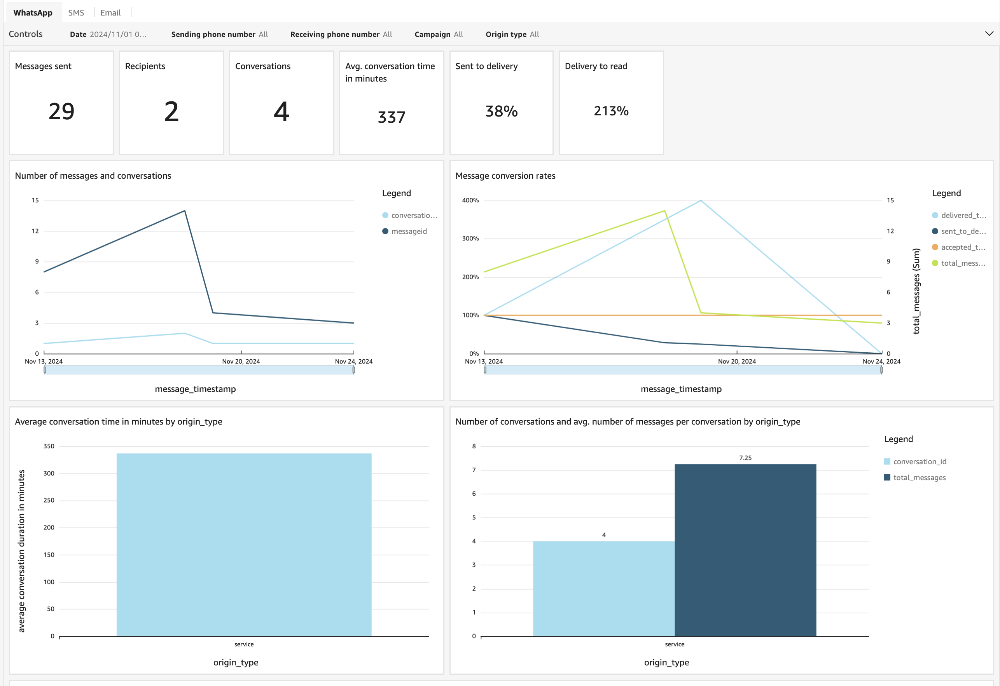
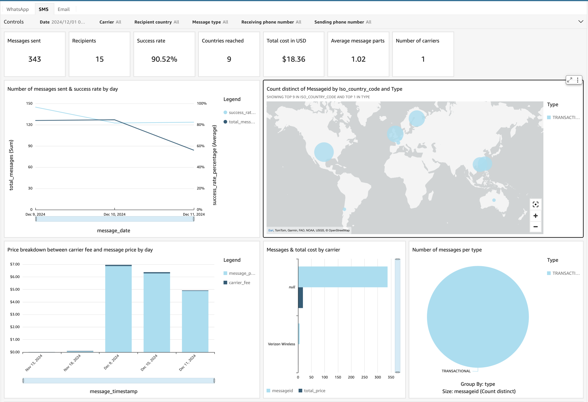
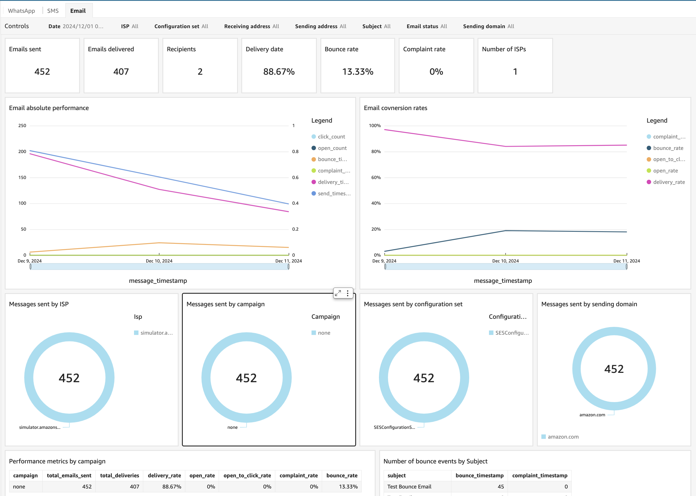
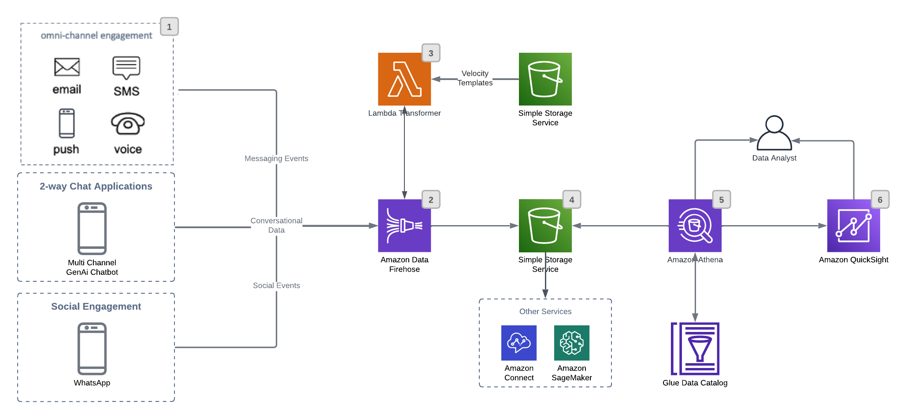
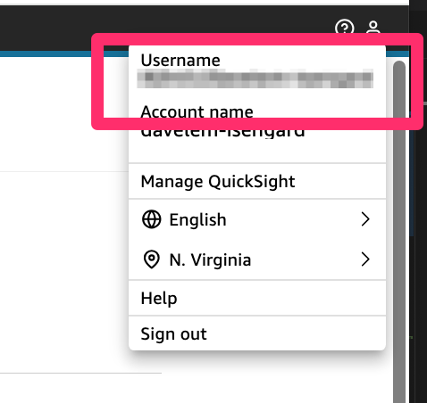

# engagement-database

>**BE AWARE:** This code base is an [Open Source](LICENSE) starter project designed to provide a demonstration and a base to start from for specific use cases. 
It should not be considered fully Production-ready.
If you plan to deploy and use this in a Production environment please review the [Using this in Production](#using-this-in-production) section at the end for some additional guidance.

## Use-case scenario

One of the most engaging features of AWS End User Messaging and Amazon Simple Email Service (SES) is the ability to track events across the various supported channels. For example, SES exposes events like: Sent, Opened, Clicked, Bounced, etc. SMS exposes events like: Sent, Delivered, Blocked, etc.

For more detail, see the events here:

- [Email](https://docs.aws.amazon.com/ses/latest/dg/event-publishing-retrieving-firehose-contents.html)
- [SMS](https://docs.aws.amazon.com/sms-voice/latest/userguide/configuration-sets-event-format.html#configuration-sets-event-format-sms-example)
- [MMS](https://docs.aws.amazon.com/sms-voice/latest/userguide/configuration-sets-event-format.html#configuration-sets-event-format-mms-example)
- [Voice](https://docs.aws.amazon.com/sms-voice/latest/userguide/configuration-sets-event-format.html#configuration-sets-event-format-voice-example)
- [WhatsApp](https://docs.aws.amazon.com/social-messaging/latest/userguide/managing-event-destination-dlrs.html)

And with the evolution of Generative AI we are seeing more conversational chatbots being built using two-way channels like SMS and WhatsApp, i.e. https://github.com/aws-samples/two-way-sms-chat-with-a-generative-ai-chatbot

This solution is a deployable starter project that combines channel engagement and conversational data into a centralized data store. You can also optionally deploy a QuickSight Dashboard to visualize the engagement data:

| WhatsApp | SMS | Email |
| -------- | --- | ----- |
|  |  |  |


Combining conversational data with engagement events allows for a number of interesting customer use cases:

* The ability to feed engagement and conversation information into Machine Learning (ML) models to do more advanced analysis like Send Time Optimization...i.e. Lets send communications at the right time when users will have a higher chance to engage. 
* Sentiment analysis on conversational data using Amazon Comprehend
* Natural language analysis using Amazon Q in QuickSight
    * “Show me all customers who reacted (thumbs up) to our latest WhatsApp campaign”
    * “Are customers happy with our latest multi-channel marketing campaign”
    * What percentage of our outbound communications (campaign or event driven) are resulting in conversations?
    * Customer Service Agents can see the most recent interactions with users while on the call.
        * User: “I’m calling to get more information on the WhatsApp message I just received”
        * Agent: [Looks at Customer Profile and sees we just sent information on new Investment Management product] “I’d be happy to discuss our new service to help insure you have the funds needed for your retirement.” 
* The ability to pull engagement/conversation data into other data sources such as Amazon Connect Customer Profiles, Salesforce.com or any Customer Data Platforms (CDP)
* Sender Reputation management with the ability to see engagement metrics across multiple channels in Amazon QuickSight

## Solution components

On a high-level, the solution consists of the following components, each contained in a separate folder:

* cdk-stacks - AWS CDK stacks:
    - `cdk-backend-stack` with all the backend resources needed for the solution (AWS Lambda, Amazon API Gateway, Amazon Cognito etc)
    - `quicksight-stack` Athena views and QuickSight Dashboards (optional deployment)

### Solution architecture:


[See Numbers Above]

1. Customers can interact with users using channels that support two-way conversations such as SMS, Email, and Voice.
2. [AWS End User Messaging](https://docs.aws.amazon.com/sms-voice/latest/userguide/configuration-sets-event-destinations.html) and [Amazon SES](https://docs.aws.amazon.com/ses/latest/dg/monitor-using-event-publishing.html) both support sending event data to different destinations such as: Amazon Data Firehose, CloudWatch, EventBridge (SES only) and Simple Notification Services (SNS)
3. All inbound events will be transformed to a common (canonical) data format to make queries and analytics easier. Amazon Data Firehose has built-in ability to transform records using a Lambda function. The Lambda function will use [Apache Velocity Templates](https://velocity.apache.org/engine/devel/user-guide.html#what-is-velocity) to transform the JSON. The templates will be stored in S3, so they can be easily modified without code changes.
4. Raw event data is stored on Amazon S3 and can be used to push information into other AWS Services such as Connect Customer Data Profiles or Amazon Sagemaker for ML training.
5. Amazon Athena allows Data Analysts to issue direct queries for more detailed AdHoc reports, or send the data to Amazon QuickSight.
6. Amazon QuickSight and Q for QuickSight will offer more advanced visualizations and natural language queries of the data.


## Solution prerequisites
* AWS Account
* AWS IAM user with Administrator permissions
* Node (> v18) and NPM (> v8.19) [installed and configured on your computer](https://nodejs.org/en/download/package-manager)
* AWS CLI (v2) [installed and configured on your computer](https://docs.aws.amazon.com/cli/latest/userguide/getting-started-install.html)
* AWS CDK (v2) [installed and configured on your computer](https://docs.aws.amazon.com/cdk/v2/guide/getting_started)
* If configuring WhatsApp: An [ACTIVE WhatsApp Phone Number provisioned](https://docs.aws.amazon.com/social-messaging/latest/userguide/getting-started.html) in AWS End User Messaging. Note: This must be an Active number that has been registered with Meta/WhatsApp.

## Solution setup: Base Stack

The below instructions show how to deploy the solution using AWS CDK CLI. 

> Note:If you are using a Windows device please use the [Git BASH](https://gitforwindows.org/#bash) terminal and use alternative commands where highlighted.

1. Clone the solution to your computer (using `git clone`)

2. Check AWS CLI
    - AWS CDK will use AWS CLI local credentials and region. These can be either
      - environment variables (AWS_ACCESS_KEY_ID AWS_SECRET_ACCESS_KEY, AWS_SESSION_TOKEN, AWS_DEFAULT_REGION) set directly in the command line
      - from a [credentials file](https://docs.aws.amazon.com/cli/latest/userguide/cli-configure-files.html), either using the default profile or setting a specific one (i.e. `export AWS_PROFILE=yourProfile`)
    - check your AWS CLI configuration by running any AWS CLI command (e.g. `aws s3 ls`)
    - you can confirm the configured region with
        `aws ec2 describe-availability-zones --output text --query 'AvailabilityZones[0].[RegionName]'`
    - AWS SDK (used in the configure script in step 4) can use either the environment variables or credentials file/profile config, however note that the region environment variable in this case is AWS_REGION rather than AWS_DEFAULT_REGION (as used in awscli)

3. Install NPM packages
    - Open your Terminal and navigate to `engagement-database/cdk-stacks`
    - Run `npm run install:all`
    - This script goes through all packages of the solution and installs necessary modules (webapp, cdk-stacks, lambdas, lambda-layers)


4. Configure CDK stacks
    - In your terminal, navigate to `engagement-database/cdk-stacks`
    - Start the configuration script in interactive mode 
      `node configure.js -i`
    - (You can configure it via single command, by directly providing parameters, as described in the script help instructions which you can see by running 
      `node configure.js -h`)
    - When prompted, provide the following parameters:
        - `whatsapp-enabled`: Set to true to enable WhatsApp support
        - `eum-whatsapp-sns-topic-arn`: The ARN of the SNS Topic that was used when configuring your WhatsApp Business Account.
        - `quicksight-stack-enabled`: Ignore for now and leave set to `false` this will be populated when deploying the optional QuickSight stack below.


5. Deploy CDK stacks
    - In your terminal navigate to `engagement-database/cdk-stacks`
    - If you have started with a new environment, please bootstrap CDK: `cdk bootstrap`
    - Run the script: `npm run cdk:deploy:base`
        - On **Windows devices** use `npm run cdk:deploy:gitbash:base`
    - This script deploys CDK stacks
    - Wait for all resources to be provisioned before continuing to the next step
    - AWS CDK output will be provided in your Terminal.

7. Configure Alarm Actions/Notifications (Optional, but Recommended)
    - The solution will automatically create metrics to track errors while transforming data. Cloudwatch Alarms have also been configured. You can optionally setup actions on the alarm to get notifications if there are errors.
    - Make note of the Alarm names that are output by the CDK deployment. You can also open up the CloudFormation Stack and goto the `Outputs` tab to see the Alarm name.
    - Open the alarm in the CloudWatch console.
    - Configure an Action for the alarm, i.e. [setup an SNS notification](https://docs.aws.amazon.com/AmazonCloudWatch/latest/monitoring/Notify_Users_Alarm_Changes.html) to receive Emails for the Alarm

## Solution Setup: QuickSight Dashboard (OPTIONAL)

> Note: Before deploying this stack, you need to deploy the [Solution Setup: Base Stack](#solution-setup-base-stack) solution first and wait until the solution is deployed as the Outputs from that deployment will be used as inputs below.

1. Configure Quicksight
    - Make note of the S3 buckets used for the Engagement Database Solution above and Athena Query results. If a bucket for Athena Query results doesn't already exist, please create one.
    - Configure QuickSight
        - If QuickSight hasn't been configured, please [Configure QuickSight](quicksight-configuration/README.md#new-quicksight-setup)
        - If QuickSight is already configured please verify [Amazon Athena and Amazon S3 are configured services](quicksight-configuration/README.md#adding-s3-and-athena-to-quicksight-services)
    - Make note of QuickSight Admin Username 
        - While in QuickSight select the user icon at the top-right of the screen and copy the Username which looks like: `Admin/[Username]`
        

2. Configure CDK stacks
    - In your terminal, navigate to `engagement-database/cdk-stacks`
    - Start the configuration script in interactive mode
      `node configure.js -i`
    - When prompted, provide the following parameters:
        - `whatsapp-enabled`: Set to true to enable WhatsApp support
        - `eum-whatsapp-sns-topic-arn`: The ARN of the SNS Topic that was used when configuring your WhatsApp Business Account.
        - `quicksight-stack-enabled`: Set to true to enable QuickSight support
        - `athena-query-storage-s3-bucket-name`: The S3 Bucket of where Athena should store query results. You can use the same bucket as the one used for the Access Logs above which is `[CDK Output: AccessLogsBucketName]`. Query output will be encrypted using AWS Managed Keys
        - `quicksight-admin-username`: The Quicksight Principal Username copied in the previous step. Should look like `Admin/[Quicksight Username]`
        - `lang-option`: The language of the dashboard template that will be used if exists. Current supported language [en, es]. Default uses 'en'

3. Deploy CDK stacks
    - In your terminal navigate to `engagement-database/cdk-stacks`
    - Deploy the QuickSight CDK Stack: `npm run cdk:deploy:quicksight`
        - On Windows devices use `cdk:deploy:gitbash:quicksight`
    - Wait for all resources to be provisioned before continuing to the next step

4. Test the solution
    - Navigate to QuickSight, select Dashboards, and open the `Messaging Dashboard`

## Testing
The following sections provide instructions on how to test the solution using the AWS CLI. Its recommended to use the [CloudShell](https://docs.aws.amazon.com/cloudshell/latest/userguide/welcome.html) in the AWS Management Console for the commands.

### Testing End User Messaging Events:
- Verify you have an active End User Messaging Origination Phone Number provisioned in your account
- Using CloudShell in the AWS Management Console, run the following commands to send test messages
- Replace the values in between squared brackets with your origination, destination, and config-set names.

#### SMS
```bash
aws pinpoint-sms-voice-v2 send-text-message \
--destination-phone-number "[Your Destination Phone Number in E.164 Format]" \
--message-body "Hello from AWS CLI" \
--origination-identity "[End User Messaging Origination Phone Number in E.164 Format]" \
--configuration-set-name "[CDK Output: EndUserMessagingConfigurationSetName]"
```

#### MMS

The media files have to be stored in an S3 bucket. Supported media file formats are listed in [MMS file types, size and character limits](https://docs.aws.amazon.com/sms-voice/latest/userguide/mms-limitations-character.html). For more information on creating an S3 bucket and managing objects, see [Creating a bucket](https://docs.aws.amazon.com/AmazonS3/latest/userguide/create-bucket-overview.html) and [Uploading objects in the S3 user guide](https://docs.aws.amazon.com/AmazonS3/latest/userguide/upload-objects.html). 

```bash
aws pinpoint-sms-voice-v2 send-media-message \
--destination-phone-number "[Your Destination Phone Number in E.164 Format]" \
--message-body "Hello from AWS CLI" \
--media-urls "s3://[Your S3 Bucket Name]/[Your Media File Name]" \
--origination-identity "[End User Messaging Origination Phone Number in E.164 Format]" \
--configuration-set-name "[CDK Output: EndUserMessagingConfigurationSetName]"
```

#### Voice
```bash
aws pinpoint-sms-voice-v2 send-voice-message \
--destination-phone-number "[Your Destination Phone Number in E.164 Format]" \
--message-body "<speak>This is a test message sent from <emphasis>AWS End User Messaging</emphasis> using the <break strength='weak'/>AWS CLI. <amazon:effect phonation='soft'>Thank you for listening.</amazon:effect></speak>" \
--message-body-text-type "SSML" \
--origination-identity "[End User Messaging Origination Phone Number in E.164 Format]" \
--configuration-set-name "[CDK Output: EndUserMessagingConfigurationSetName]"
```

- You should receive a message at the destination phone number
- After a few minutes, you should see the event in the Amazon Athena Query results

### Testing SES Events:
- Verify you have an active SES Receiving Email Address configured in your account
- Using CloudShell in the AWS Management Console, run the following command to send a test email:

```bash
aws sesv2 send-email \
--from-email-address "[Your SES Sending Email Address]" \
--destination "ToAddresses=[Your Destination Email Address]" \
--content "Simple={Subject={Data=\"Your Subject Here\",Charset=\"UTF-8\"},Body={Text={Data=\"Your email body text here\",Charset=\"UTF-8\"},Html={Data=\"<h1>Your HTML email body here</h1>\",Charset=\"UTF-8\"}}}" \
--configuration-set-name "[CDK Output: SESConfigurationSetName]"
```

- After a few minutes, you should see the event in the Amazon Athena Query results
### Testing WhatsApp Events (Only applicable if you configured WhatsApp support)
- Note: WhatsApp requires a two-way conversation to send messages. If you don't have one, you can start a conversation by sending a WhatsApp message to the number defined in the End User Messaging Console.
- Verify you have an active WhatsApp Origination Phone Number provisioned in your account
- Within CloudShell create a JSON file named `whatsapp-message.json` with the following content:

```json
{
    "messaging_product": "whatsapp",
    "recipient_type": "individual",
    "to": "[Your Destination WhatsApp Phone Number in E.164 Format]",
    "type": "text",
    "text": {
        "preview_url": false,
        "body": "Hello from AWS CLI"
    }
}
```

- Using CloudShell in the AWS Management Console, run the following command to send a test message: 

```bash
aws social-messaging send-whats-app-message \
--message file://whatsapp-message.json \
--origination-phone-number-id "[Your End User Messaging WhatsApp Phone Number ID]" \
--meta-api-version "v19.0" \
--cli-binary-format raw-in-base64-out
``` 

- You should receive a WhatsApp message at the destination phone number
- After a few minutes, you should see the event in the Amazon Athena Query results

### Testing Conversational Events

> NOTE: the [two-way-multi-channel-chat-with-a-generative-ai-chatbot GitHub Sample](https://github.com/aws-samples/two-way-multi-channel-chat-with-a-generative-ai-chatbot) can also be configured to send conversational events to the Engagement DB using the ConversationFirehoseName.

- You can test the conversational events by doing a DirectPut to the Conversation Firehose Stream. The stream can be found in the CDK Outputs as `EngagementDBBackend.ConversationFirehoseName`.
- Create a JSON file named `conversation-event.json` with the following content:

```json
{
  "accountId": "123456",
  "organizationId": "40511560934972",
  "messageId": "wamid.HBgLMTMxNzM3MzkyNTMVAgARGBI1RTU0RTdEMEFFQUZBRUUxOTEA",
  "sendingAddress": "+13175550441",
  "destinationAddress": "+13155539253",
  "channel": "whatsapp",
  "direction": "inbound",
  "knowledgeBaseId": "123456",
  "sessionId": "123456",
  "source": "bedrockkb",
  "timestamp": 1731523485968,
  "tags": {
    "account": "123456", 
    "environment": "dev"
  },
  "message": "Hello"
}
```

- Using CloudShell in the AWS Management Console, run the following command to send the event:

```bash
aws firehose put-record \
--delivery-stream-name "[CDK Output: ConversationFirehoseName]" \
--record "Data=$(cat conversation-event.json | base64)"
```

- After a few minutes, you should see the event in the Amazon Athena Query results

## Data Model

### Event Data
To simplify queries and dashboards, we have mapped incoming events to a common data model:

[Click on headers below to see details of the source messages. Scroll to the right to see all columns.]

|Athena Table Column	|[WhatsApp](https://docs.aws.amazon.com/social-messaging/latest/userguide/managing-event-destination-dlrs.html)	|[SMS](https://docs.aws.amazon.com/sms-voice/latest/userguide/configuration-sets-event-format.html)	|[Voice](https://docs.aws.amazon.com/sms-voice/latest/userguide/configuration-sets-event-format.html#configuration-sets-event-format-voice-example)	|[MMS](https://docs.aws.amazon.com/sms-voice/latest/userguide/configuration-sets-event-format.html#configuration-sets-event-format-mms-example)	|[Email](https://docs.aws.amazon.com/ses/latest/dg/event-publishing-retrieving-firehose-examples.html#event-publishing-retrieving-firehose-send)	|Comments	|
|---	|---	|---	|---	|---	|---	|---	|
|**accountId**: string	|aws_account_id	|context.accountID	|context.accountID	|context.accountID	|mail.sendingAccountId	|The AWS Account ID	|
|**organizationId**: string	|context.MetaWabaIds[0].wabaId	|context.organizationId	|context.organizationId	|context.organizationId	|mail.tags.organizationId	|Customer provided identifier to allow more granular tracking of multiple orgs running in an account	|
|**sendingId**: string	|context.MetaPhoneNumberIds[0].metaPhoneNumberId	|originationPhoneNumber	|originationPhoneNumber	|originationPhoneNumber	|mail.sourceArn	|The Origination Identifier, i.e. Phone ID for WhatsApp and SMS and From Address for Email	|
|**sendingAddress**: string	|whatsAppWebhookEntry.changes[0].value.metadata.display_phone_number	|originationPhoneNumber	|originationPhoneNumber	|originationPhoneNumber	|mail.source	|The From Address	|
|**destinationAddress**: string array	|[whatsAppWebhookEntry.changes[0].value?.messages[0]?.from]	|[destinationPhoneNumber]	|[destinationPhoneNumber]	|[destinationPhoneNumber]	|mail.destination	|String Array	|
|**channel**: string	|"whatsapp"	|"text"	|"voice"	|"media"	|"email"	|	|
|**type**: string	|[See Below](#whatsapp-type-and-status-detection)	|messageType	|messageType	|messageType	|eventType	|	|
|**status**: string	|[See Below](#whatsapp-type-and-status-detection)	|eventType	|eventType	|eventType	|Need to look at eventType to determine if there is a status or status code to pull.  i.e. for Bounce we populate with BounceType:BounceSubType	|	|
|**statusCode**: string	|[See Below](#whatsapp-type-and-status-detection)	|messageStatus	|messageStatus	|messageStatus	|	|	|
|**statusMessage**: string	|[See Below](#whatsapp-type-and-status-detection)	|messageStatusDescription	|messageStatusDescription	|messageStatusDescription	|	|	|
|**rawStatus** JSON encoded string	|[See Below](#whatsapp-type-and-status-detection)	|	|	|	|See above, would include the relevant object from above	|JSON Encoded Status Object	|
|**timestamp**: integer	|message_timestamp	|eventTimestamp	|eventTimestamp	|eventTimestamp	|timestamp	|Normalized to Epoch Time	|
|**messageId**: string	|whatsAppWebhookEntry.changes[0].statuses[0].id	|messageId	|messageId	|messageId	|mail.messageId	|	|
|**tags**: map(string, string)	|n/a	|context	|context	|context	|tags	|Array of Name/Value Pairs	|
|**channelData**: map(string, string)	|{conversationId,conversationExpiration,conversationType,biz_opaque_callback_data}	|{isoCountryCode,totalMessageParts,totalMessagePrice,totalCarrierFee,mcc,mnc}	|{isoCountryCode,callDurationInSeconds,totalDurationInMinutes,totalMessagePrice}	|{isoCountryCode,totalMessageParts,totalMessagePrice,totalCarrierFee,mcc,mnc}	|{subject}	|Array of Name/Value Pairs with data specific to the particular channel.	|
|**rawEvent**: JSON encoded string	|	|	|	|	|	|JSON Encoded Raw Event received from Kinesis	|
|	|	|	|	|	|	|	|

### WhatsApp Type and Status Detection

The following is the logic used to determine message type and status. 

Reference Links

* https://developers.facebook.com/blog/post/2022/11/28/interpreting-webhooks-whatsapp/
* https://developers.facebook.com/docs/whatsapp/cloud-api/webhooks/payload-examples
* https://www.postman.com/meta/whatsapp-business-platform/folder/tebh3mg/understanding-webhooks

Determining Type and Status

|WhatsApp Type	|type	|status	|statusCode	|statusMessage	|statusObject	|Comments	|
|---	|---	|---	|---	|---	|---	|---	|
|[Message](https://developers.facebook.com/docs/whatsapp/cloud-api/webhooks/payload-examples#received-messages)	|IF `whatsAppWebhookEntry.changes[0].value?.messages[0]?.type` exists then: **message**	|whatsAppWebhookEntry.changes[0].value.messages[0].type	|	|	|whatsAppWebhookEntry.changes[0].value.messages[0]	|	|
|[MessageStatus](https://developers.facebook.com/micro_site/url/?click_from_context_menu=true&country=US&destination=https%3A%2F%2Fdevelopers.facebook.com%2Fdocs%2Fwhatsapp%2Fcloud-api%2Fwebhooks%2Fpayload-examples%23message-status-updates&event_type=click&last_nav_impression_id=0s8TiBwy5xQsJHNLZ&max_percent_page_viewed=99&max_viewport_height_px=974&max_viewport_width_px=1792&orig_http_referrer=https%3A%2F%2Fdevelopers.facebook.com%2Fdocs%2Fwhatsapp%2Fcloud-api%2Fwebhooks%2Fpayload-examples&orig_request_uri=https%3A%2F%2Fdevelopers.facebook.com%2Fajax%2Fdocs%2Fnav%2F%3Fpath1%3Dwhatsapp%26path2%3Dcloud-api%26path3%3Dwebhooks%26path4%3Dpayload-examples&region=noam&scrolled=true&session_id=1jBnvWh1L9vT3Iuf8&site=developers)	|IF `whatsAppWebhookEntry.changes[0].statuses` exists then **messageStatus**	|whatsAppWebhookEntry.changes[0].value.statuses[0].status	|If status is failed then: whatsAppWebhookEntry.changes[0].statuses[0].status.errors[0].code	|If status is failed then: whatsAppWebhookEntry.changes[0].statuses[0].status.errors[0].message	|whatsAppWebhookEntry.changes[0].value.statuses[0]	|	|

### Conversation Data Model
The Conversation Table in Athena has the following structure:
- `accountId` (string) - The AWS Account ID
- `organizationId` (string) - The Customer provided identifier to allow more granular tracking of multiple orgs running in an account
- `messageId` (string) - The messageId generated by AWS End User Messaging
- `sendingAddress` (string) - The From Address
- `destinationAddress` (string) - The Destination Address
- `channel` (string) - The channel the message was sent from (text, voice, media, email, whatsapp)
- `direction` (string) - The direction of the message (inbound or outbound)
- `knowledgeBaseId` (string) - The ID of the Bedrock Knowledge Base used in the conversation
- `sessionId` (string) - A Session ID common across all messages in a conversation
- `source` (string) - Indicates if the question was answered by the Bedrock Knowledge Base or the General LLM
- `timestamp` (integer) - The timestamp of the message.
- `tags` (map(string, string)) - Array of Name/Value Pairs provided by the customer and can be used for filtering conversations in Athena
- `message` (string) - The message sent by the end user or the response from the Bedrock Knowledge Base

## Data Mapping Modifications
All Data transformations are done in the Lambda Tranformer function that is called by Amazon Data Firehose. The function uses [Apache Velocity Templates](https://velocity.apache.org/) to transform the data into the canonical data model. Velocity Templates are stored in the Amazon S3 templates bucket created by the CDK stack. 

To modify the data mapping, please update the template files in `/cdk-stacks/templates` and redeploy the CDK stack.

If you add/modify fields in the templates you will also need to update the Amazon Glue Table schema (`glueTable`) in /`cdk-stacks/lib/cdk-backend-stack.ts`

> Note: you can update the templates directly in S3, but if the stack is redeployed, the templates will be overwritten with the default templates in `/cdk-stacks/templates`.

## Associating AWS data with Customer supplied identifiers
AWS End User Messaging and SES both allow you to supply customer supplied information that is carried over to each event in the Engagement Database. This allows you to associate AWS data with your own customer identifiers.

For example, if you send an SMS message to a phone number, you can supply an `customerId` that is carried over to the event in the Engagement Database. This allows you to query the data by your own identifiers.

### End User Messaging Context Parameter
Customer supplied identifiers should be passed in the `context` parameter of the [SendTextMessage](https://docs.aws.amazon.com/pinpoint/latest/apireference_smsvoicev2/API_SendTextMessage.html) or [SendMediaMessage](https://docs.aws.amazon.com/pinpoint/latest/apireference_smsvoicev2/API_SendMediaMessage.html) API calls.

Once in the Engagement Database, the `context` parameter is stored as a map(string, string) column in the `tags` column of the `engagementdb-events-table`. When using the 'tags' column in Athena queries, you can reference tag as `tags['tagname']`.

### Simple Email Services (SES) Tags
Customer supplied identifiers should be passed in the `EmailTags` parameter of the [SendEmail](https://docs.aws.amazon.com/ses/latest/APIReference-V2/API_SendEmail.html#SES-SendEmail-request-EmailTags) API call.

Once in the Engagement Database, the `tags` parameter is stored as a map(string, string) column in the `tags` column of the `engagementdb-events-table`. When using the 'tags' column in Athena queries, you can reference tag as `tags['tagname']`.

### WhatsApp Context Parameter
WhatsApp does not support tags, but you can pass a `biz_opaque_callback_data` as a parameter of the message in the [SendWhatsAppMessage](https://docs.aws.amazon.com/social-messaging/latest/APIReference/API_SendWhatsAppMessage.html#API_SendWhatsAppMessage_RequestSyntax) API call.

Once in the Engagement Database, the `biz_opaque_callback_data` parameter is stored as a string column in the `channeldata` column of the `engagementdb-events-table`. When using the 'tags' column in Athena queries, you can reference the `biz_opaque_callback_data` as `channeldata['biz_opaque_callback_data']`.

## Sample Athena Queries
> Note: The Athena data is partitioned by year, month, day, and hour.  You can use the `ingest_timestamp` column to filter the data for a specific hour. This improves query performance and reduces costs as Athena has less data to scan. It is recommended to use the `ingest_timestamp` column in all of your queries.

### General
#### Troubleshooting a specific messageId
```sql
SELECT *
FROM "engagementdb-glue-db"."engagementdb-events-table" events
WHERE "messageid" = '01000193c01f592c-ad6098e1-7247-448b-9dce-5e4213584ab6-000000'
AND ingest_timestamp >= DATE_ADD('day', -7, CURRENT_TIMESTAMP) 
ORDER BY timestamp
```

#### Count by message channel
```sql
SELECT channel, count(channel)
FROM "engagementdb-glue-db"."engagementdb-events-table" events
WHERE ingest_timestamp >= DATE_ADD('day', -30, CURRENT_TIMESTAMP)  -- Last 30 days, adjust as needed
GROUP BY 1
ORDER BY 2 desc
```

### SMS
#### SMS costs by country
```sql
SELECT 
    channeldata['isocountrycode'] AS country,
    SUM(CAST(channeldata['totalmessageprice'] AS DECIMAL(10,4))) AS total_sms_cost,
    SUM(COALESCE(CAST(channeldata['totalcarrierfee'] AS DECIMAL(10,4)), 0)) AS total_carrier_cost
FROM "engagementdb-glue-db"."engagementdb-events-table"
WHERE 
    channeldata['isocountrycode'] IS NOT NULL
    AND channeldata['totalmessageprice'] IS NOT NULL
    AND channel = 'text'  -- Assuming we only want SMS events
    AND ingest_timestamp >= DATE_ADD('day', -30, CURRENT_TIMESTAMP)  -- Last 30 days
GROUP BY channeldata['isocountrycode']
ORDER BY country
```

#### SMS Costs by AWS Account and Organization
When sending SMS messages you will need to populate the `organizationId` field in the `context` [parameter](https://docs.aws.amazon.com/pinpoint/latest/apireference_smsvoicev2/API_SendTextMessage.html#pinpoint-SendTextMessage-request-Context).  

```sql
SELECT 
    accountid,
    COALESCE(organizationid, 'unknown') AS organizationid,
    COUNT(*) AS total_messages,
    SUM(CAST(channeldata['totalmessageprice'] AS DECIMAL(10,4))) AS total_sms_cost,
    SUM(COALESCE(CAST(channeldata['totalcarrierfee'] AS DECIMAL(10,4)), 0)) AS total_carrier_cost
FROM "engagementdb-events-table"
WHERE 
    accountid IS NOT NULL
    AND channeldata['totalmessageprice'] IS NOT NULL
    AND channel = 'text'  -- Assuming we only want SMS events
    AND ingest_timestamp >= DATE_ADD('day', -30, CURRENT_TIMESTAMP)  -- Last 30 days
GROUP BY 
    accountid, 
    COALESCE(organizationid, 'unknown')
ORDER BY 
    accountid, 
    COALESCE(organizationid, 'unknown')
```

### Email
#### All Subject Lines sent to an email address
```sql
SELECT 
    destinationaddress[1] AS email_address,
    channeldata['subject'] AS subject_line,
    timestamp AS sent_timestamp
FROM "engagementdb-events-table"
WHERE 
    channel = 'email'
    AND cardinality(destinationaddress) > 0
    AND channeldata['subject'] IS NOT NULL
    AND destinationaddress[1] = 'example@email.com'  -- Replace with the specific email address you're looking for
    AND ingest_timestamp >= DATE_ADD('day', -30, CURRENT_TIMESTAMP)  -- Last 30 days, adjust as needed
ORDER BY timestamp DESC
```

#### Email Performance by hour
Monitor sends, bounces, complaints by hour for the last 30 days.
```sql
SELECT 
    DATE_TRUNC('hour', ingest_timestamp) time_window,
    SUM(CASE WHEN status = 'Send' THEN 1 ELSE 0 END) AS sent_count,
    SUM(CASE WHEN status = 'Delivery' THEN 1 ELSE 0 END) AS delivered_count,
    SUM(CASE WHEN status = 'Bounce' THEN 1 ELSE 0 END) AS bounced_count,
    SUM(CASE WHEN status = 'Complaint' THEN 1 ELSE 0 END) AS complaint_count
FROM "engagementdb-events-table"
WHERE 
    channel = 'email'
    AND type IS NOT NULL
    AND ingest_timestamp >= DATE_ADD('day', -30, CURRENT_TIMESTAMP)  -- Last 30 days, adjust as needed
GROUP BY 1
ORDER BY 1
```

### WhatsApp

#### WhatsApp Performance by hour
```sql
SELECT 
    DATE_TRUNC('hour', ingest_timestamp) time_window,
    SUM(CASE WHEN status = 'accepted' THEN 1 ELSE 0 END) AS accepted_count,
    SUM(CASE WHEN status = 'sent' THEN 1 ELSE 0 END) AS sent_count,
    SUM(CASE WHEN status = 'delivered' THEN 1 ELSE 0 END) AS delivered_count,
    SUM(CASE WHEN status = 'read' THEN 1 ELSE 0 END) AS read_count,
    SUM(CASE WHEN status = 'error' THEN 1 ELSE 0 END) AS error_count
FROM "engagementdb-events-table"
WHERE 
    channel = 'whatsapp'
    AND type IS NOT NULL
    AND ingest_timestamp >= DATE_ADD('day', -30, CURRENT_TIMESTAMP)  -- Last 30 days, adjust as needed
GROUP BY 1
ORDER BY 1
```


## Troubleshooting
- If you don't receive data in the Athena Query results, please check the following:
    - Inspect the CloudWatch Logs for the `FirehoseTransformer` Lambda function to ensure it is processing messages correctly
        - For more detailed logs you can [Set the Log Level to TRACE](https://docs.aws.amazon.com/lambda/latest/dg/monitoring-cloudwatchlogs-advanced.html#monitoring-cloudwatchlogs-log-level-setting)
- Credential Errors:
```
@aws-sdk/credential-provider-node - defaultProvider::fromEnv WARNING:
    Multiple credential sources detected:
    Both AWS_PROFILE and the pair AWS_ACCESS_KEY_ID/AWS_SECRET_ACCESS_KEY static credentials are set.
    This SDK will proceed with the AWS_PROFILE value.

    However, a future version may change this behavior to prefer the ENV static credentials.
    Please ensure that your environment only sets either the AWS_PROFILE or the
    AWS_ACCESS_KEY_ID/AWS_SECRET_ACCESS_KEY pair.
```
Remove either the AWS_PROFILE or the credentials from your environment.

## Clean up

To remove the solution from your account, please follow these steps:

1. Remove CDK Stacks
    - Run `cdk destroy --all`

2. Remove deployment parameters from AWS System Manager Parameter Store
    - Run `node configure.js -d`

## Using this in Production

It is critical that before you use any of this code in Production that you work with your own internal Security and Governance teams to get the appropriate Code and AppSec reviews for your organization. 

Although the code has been written with best practices in mind, your own company may require different ones, or have additional rules and restrictions.

You take full ownership and responsibility for the code running in your environment, and are free to make whatever changes you need to.

**Some of the things you will want to consider**
- The starter project creates an S3 bucket to store engagement events and conversation data. You may want to use [Amazon Macie](https://docs.aws.amazon.com/macie/latest/user/what-is-macie.html) to assist in discovery of potentially sensitive data in S3 buckets. Amazon Macie can assist in discovery of potentially sensitive data in S3 buckets, and can be enabled on a free trial for 30 days, up to 150GB per account.
- There is the potential for end users to send Personal Identifiable Information (PII) in messages. You may want to use [Amazon Comprehend](https://docs.aws.amazon.com/comprehend/latest/dg/what-is.html) to assist in redacting PII before storing messages in S3. The following blog post provides a good overview of how to use Comprehend to redact PII: [Redact sensitive data from streaming data in near-real time using Amazon Comprehend and Amazon Kinesis Data Firehose](https://aws.amazon.com/blogs/machine-learning/redact-sensitive-data-from-streaming-data-in-near-real-time-using-amazon-comprehend-and-amazon-kinesis-data-firehose/).
- The starter project has extensive logging to CloudWatch, but does not have any monitoring or tracing included, you may want to look at using tools like Cloudwatch Alarms and X-ray.
- The starter solution implements AWS encryption whenever possible. Your company may have additional requirements to implement Customer Managed Keys.
- The starter project tags all resources with the tags listed in `cdk-stacks/config.params.json` and anything created through the dashboard has the tags in `cdk-stacks/lambdas/constants/Tags.js` added. You may wish to replace them with your own company requirements, or tag at a more granular level.
