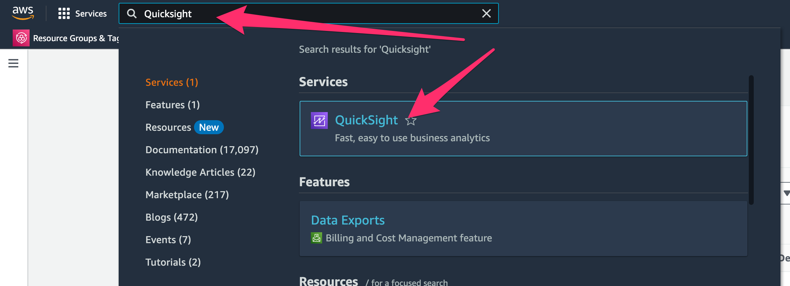
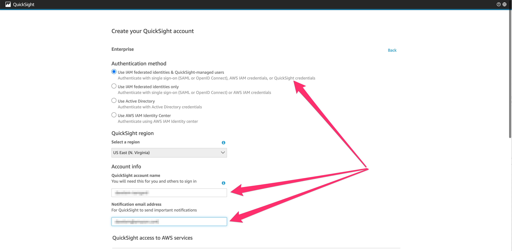
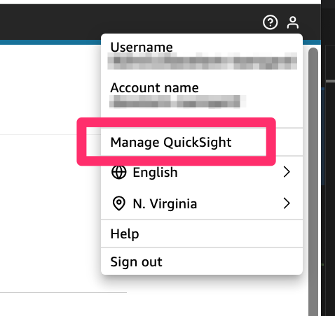
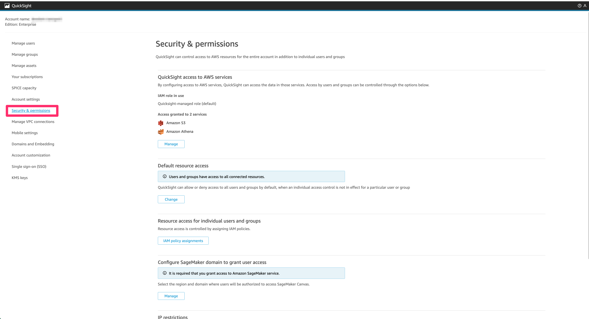

# QuickSight Configuration

## New QuickSight Setup
> NOTE: The following will configure a new QuickSight account that will incur additional charges.  The following will also grant access for QuickSight to access data stored in Amazon S3.  **Please consult with your AWS Admins and Information Security departments if you don't have a full understanding of the choices below.**

> **IMPORTANT:** This solution requires a QuickSight Enterprise edition account.  If you are using a Standard QuickSight account, you will need to [upgrade to the Enterprise edition](https://docs.aws.amazon.com/quicksight/latest/user/upgrading-subscription.html) before you can deploy the Engagement Database.

1. Navigate to QuickSight in the Console:

2. Click `Signup for QuickSight`

3. Select the plan that applies to you. Please note the additional costs.

4. Select the appropriate authentication type and enter a username and admin email address.

5. Select Amazon Athena and Amazon S3

6. Configure the Amazon S3 Buckets for Engagement Database Data
- Select the Bucket where Engagement Database is storing log data
- You will also need to select a S3 Bucket for Athena to store query results.

## Adding S3 and Athena to QuickSight Services
> If QuickSight has already been setup, please make sure Athena and S3 are added to the services available to QuickSight:

1. Hover over the icon at the top-right and navigate to `Manage QuickSight`

2. Select: `Security & Permissions`

3. Select Amazon Athena and Amazon S3

4. Configure the Amazon S3 Buckets for Engagement Database Data
- Select the Bucket where Engagement Database is storing log data
- You will also need to select a S3 Bucket for Athena to store query results.
